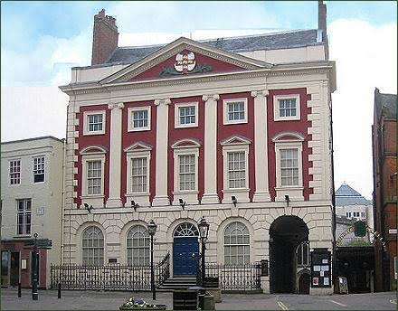
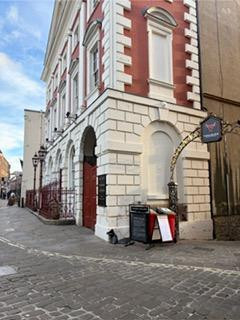
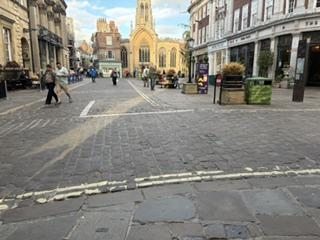

## About

This workshop brings together leading experts on macroeconomic and financial modelling to discuss recent advances in the modelling of extreme events. The workshop will be of interest to academic researchers at all levels, policymakers and practitioners.

## Programme



{{ slot.time }}<em>{{ slot.title }}</em> {{ slot.speaker }} {{ slot.affiliation }} <a class="slides" href="slides/{{ slot.slides }}">Slides</a>Slides (TBA){{ slot.title }}



## Dinner

  
18:00 – 20:00 
Chopping Block at Walmgate Ale House 
25 Walmgate, York YO1 9TX

  

    <iframe class="map" loading="lazy" referrerpolicy="no-referrer-when-downgrade"
      src="https://www.google.com/maps?q=Chopping+Block+at+Walmgate+Ale+House,+25+Walmgate,+York+YO1+9TX&z=16&output=embed"></iframe>
    
  

## Venue

  
The Riverside Room, The Guildhall 
St Martin's Courtyard, Coney Street 
York YO1 9QL, United Kingdom

  

    <iframe class="map" loading="lazy" referrerpolicy="no-referrer-when-downgrade"
      src="https://www.google.com/maps?q=The+Guildhall,+Coney+Street,+York+YO1+9QL&z=16&output=embed"></iframe>
    
  

**The Entrance to the Guildhall:**

From the Mansion House building, walk through the archway to the bottom.

<figure class="step-fig">
  
  <figcaption>Guildhall</figcaption>
</figure>
<figure class="step-fig">
  
  <figcaption>The view from the side of the building, Miller &amp; Carter, and Tomahawk will be on your right.</figcaption>
</figure>
<figure class="step-fig">
  
  <figcaption>The view looking out from the Guildhall entrance to St Helen's Square.</figcaption>
</figure>

## Practical Information

- Wi-Fi: please use the *UoY-Fi* network
- Presentation materials: [github.com/efx-york26/York_Workshop_2026](https://github.com/efx-york26/York_Workshop_2026)
- GitHub: [github.com/efx-york26/York_Workshop_2026](https://github.com/efx-york26/York_Workshop_2026)

## Local Organiser

Yongcheol Shin *(University of York)*

## Organising Committee

- Tomohiro Ando *(Melbourne Business School)*
- Renee Fry-McKibbin *(Australian National University)*
- Matthew Greenwood-Nimmo *(University of Melbourne)*
- Yongcheol Shin *(University of York)*

## Contact

Yongcheol Shin (Workshop)
[yongcheol.shin@york.ac.uk](mailto:yongcheol.shin@york.ac.uk)

Ze-Yu Zhong (Slides)
[zeyu.zhong.1@unimelb.edu.au](mailto:zeyu.zhong.1@unimelb.edu.au)
